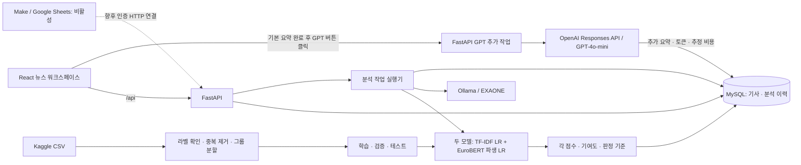

# Fake_News(By-Kaggle)

두 Kaggle 데이터셋으로 학습한 영어 뉴스 분류기와 **Ollama 기본 요약·GPT-4o-mini 추가 요약**을 연결한 SAI 뉴스 워크스페이스입니다. React에서 기사를 관리하고 FastAPI가 AI를 직접 호출하며, MySQL에 기사·분석 이력·GPT 토큰 사용량을 저장합니다. Make 연동용 자동화 파이프라인도 구현했으며 현재 비활성 상태입니다.

> 분류 점수는 학습 데이터의 문체·어휘 패턴에 따른 모델 점수입니다. 사실의 참·거짓 확률이 아니며, 요약도 외부 사실 검증을 수행하지 않습니다.


## 구현한 기능

- 기사 등록·조회·제목 검색·페이지 구분·수정·삭제, 원문 링크와 언어 표시
- 기사 버전 확인과 오래된 수정 요청 거부(HTTP 409)
- TF-IDF + 로지스틱 회귀 영어 뉴스 분류, 부적절한 입력 보류, 불확실한 결과 표시
- 기존 모델을 복사해 보존하고 EuroBERT 문맥 특징을 추가한 파생 로지스틱 회귀 학습, 동일 분할의 성능 비교
- 같은 기사에서 두 모델의 점수·판정·단어별 기여도·실제 파라미터를 비교하고 한 칸에서 예측 과정 설명
- Ollama `exaone3.5:2.4b` 뉴스 요약, 한국어·영어 출력, 긴 기사 분할·통합
- Ollama 결과 아래 GPT 추가 요약 버튼, 같은 원문 스냅샷을 `gpt-4o-mini`로 독립 요약하고 토큰·추정 비용 표시
- FastAPI 서버에서 OpenAI Responses API 호출, 완료 결과 재사용·명시적 실패 재시도·API 키 비공개
- Make 연동용 인증 API·중복 요청 제어·비활성 워크플로 계약·로컬 실행 클라이언트 준비
- 요청 시점의 기사 원문·버전 스냅샷과 분석 결과 JSON 저장, 상태 자동 갱신
- MySQL 컨테이너, Alembic 마이그레이션, 설치·실행 스크립트, 단위·통합 검증
- 기존 Streamlit 프로토타입과 다운로드·학습·분류·요약 CLI 유지

개발 환경에서 실제 AI 연결을 검증했습니다. 새 설치의 기본값은 `AI_ENABLED=false`입니다. 데이터를 다운로드해 분류기를 학습하고 Ollama를 준비한 뒤 활성화합니다.

## 기술과 구조

| 영역 | 기술 |
| --- | --- |
| 프론트엔드 | React 19, TypeScript, Vite |
| API | FastAPI, Pydantic, Uvicorn |
| DB | MySQL 8.4, SQLAlchemy, PyMySQL, Alembic |
| 분류 | scikit-learn, TF-IDF, LogisticRegression, EuroBERT, OpenVINO/ONNX |
| 요약 | Ollama / EXAONE 3.5 2.4B(기본), OpenAI Responses API / GPT-4o-mini(추가) |
| 자동화 연동 | Make·Google Sheets용 HTTP 처리 계약, 인증·중복 제어 API(비활성) |
| 개발·검증 | uv, npm, Docker Compose, pytest, HTTPX |



```text
frontend/src/                React 화면, 타입이 있는 API 호출, 반응형 CSS
src/news_api/
  main.py                    API 라우트, CORS, DB 오류 처리
  models.py / schemas.py     DB 모델, 입력 검증, 응답 형식
  config.py / db.py          환경 설정, DB 엔진·세션
  jobs.py                    작업 상태, 추론 직렬화, 재시작 처리
  ai.py                      기존 분류·요약 모델 연결 어댑터
src/news_ai/
  data.py                    KaggleHub 다운로드, 라벨·중복·그룹 점검
  text.py                    학습·예측 공통 전처리
  model.py                   학습, 평가, 모델 저장, 분류 추론
  transformer.py             원본 모델 복사, 특징 캐시, EuroBERT 파생 LR 학습·비교
  onnx_encoder.py            원본 특징 검증, ONNX 내보내기, Intel GPU/CPU 실행
  selection.py               검증 성능에 따른 기본 분류기 선택
  summarizer.py              Ollama 요약, 긴 기사 분할·통합
  openai_summary.py          선택적 GPT 요약, 토큰 사용량·추정 비용, 명시적 오류
  cli.py                     다운로드·학습·분류·요약 명령
backend/migrations/          Alembic 마이그레이션
scripts/                     설정·실행·실제 연동 검증
integrations/make/            비활성 자동화 계약, 요청 예제, 향후 연결 절차
tests/                       데이터·분류·요약·웹 API 테스트
artifacts/metrics.json       최초 학습의 집계 평가 결과
artifacts/data_audit.json    최초 데이터 점검의 집계 결과
compose.yaml                 프로젝트 전용 MySQL
app.py                       Streamlit 프로토타입
pyproject.toml / uv.lock     Python 의존성과 고정 버전
frontend/package-lock.json   프론트엔드 고정 버전
```

## 설치와 실행

### 1. 환경 준비

아래는 **Windows PowerShell** 기준입니다. Python 3.11–3.13, [uv](https://docs.astral.sh/uv/), Node.js 22.12 이상 또는 24 계열, Docker Desktop과 Git이 필요합니다. Docker Desktop을 먼저 실행합니다.

```powershell
git clone https://github.com/An1207/Fake_News-By-Kaggle.git
cd Fake_News-By-Kaggle
.\scripts\setup_web.ps1
```

설정 스크립트는 고정 버전의 Python·npm 의존성을 설치하고, `.env` 생성, MySQL 실행·상태 확인, DB 마이그레이션, 프론트엔드 빌드를 수행합니다. 실행 정책이 로컬 스크립트를 막으면 현재 터미널에만 `Set-ExecutionPolicy -Scope Process Bypass`를 적용할 수 있습니다.

`.env`가 없으면 `scripts/init_web_env.py`가 프로젝트 전용 DB 비밀번호를 생성합니다. 기존 파일을 덮어쓰지 않고 비밀번호를 출력하지 않습니다. `.env.example`은 변수 참고용입니다.

### 2. 웹 서비스 시작

프로젝트 폴더에서 두 터미널을 사용합니다.

```powershell
# 터미널 1: FastAPI (단일 worker)
.\scripts\run_api.ps1

# 터미널 2: React
.\scripts\run_frontend.ps1
```

| 서비스 | 주소 |
| --- | --- |
| React 화면 | http://127.0.0.1:5173 |
| FastAPI 문서 | http://127.0.0.1:8011/docs |
| API 상태 | http://127.0.0.1:8011/api/health |
| MySQL | `127.0.0.1:13306`, DB `sai_news` |

React 개발 서버가 `/api`를 FastAPI로 프록시합니다. DB는 13306, API는 8011을 사용합니다. 기존 8001 포트가 다른 Docker 프로젝트와 충돌해 API 포트를 분리했습니다.

설치 후 재시작에는 프로젝트 루트에서 다음 명령을 사용할 수 있습니다.

```powershell
.\scripts\start_web.ps1
```

이 명령은 Docker Desktop과 프로젝트 MySQL을 준비한 뒤 DB 마이그레이션을 적용하고 FastAPI·React를 숨김 백그라운드 프로세스로 실행합니다. 이미 사용 중인 포트는 중복 실행하지 않고 준비 상태를 검사합니다. 직접 API와 React 프록시의 `/api/health`까지 DB 연결 성공을 확인해야 완료로 표시합니다. 터미널별로 로그를 보며 개발하려면 기존 `run_api.ps1`, `run_frontend.ps1`을 사용합니다. 실행 로그는 공개 Git에서 제외되는 `.tools/server-logs/`에 저장합니다. 재시작 이후 열린 웹 페이지는 새로고침하거나 **연결 다시 확인**을 누릅니다.

데이터는 named volume `sai-news_mysql_data`에 유지되며 `docker compose -p sai-news down`으로 컨테이너를 종료해도 보존됩니다. Windows 재부팅 이후에는 시작 명령을 다시 실행해야 합니다.

DB 포트는 `.env`의 `MYSQL_PORT`로 바꾸고 Compose를 다시 적용합니다. API 포트는 프로젝트 루트 `.env`의 `API_PORT`로 바꿉니다. API 실행 스크립트와 React 프록시가 같은 설정을 읽으므로 변경 후 두 서버를 재시작합니다. 서비스는 로그인 없는 **로컬 개발용**으로 `127.0.0.1`에 바인딩합니다. 외부 배포에는 인증·권한·배포 구성이 필요합니다.

### 3. 데이터 다운로드와 분류기 학습

원본 CSV와 모델 바이너리는 Git에 포함하지 않습니다. Kaggle 이용 조건과 필요한 인증을 준비한 뒤 실행합니다.

```powershell
.venv\Scripts\python.exe -m news_ai download --data-dir data/raw
.venv\Scripts\python.exe -m news_ai train --data-dir data/raw --output-dir artifacts
```

다운로드 명령은 제공된 API를 호출합니다.

```python
import kagglehub

isot_path = kagglehub.dataset_download("clmentbisaillon/fake-and-real-news-dataset")
welfake_path = kagglehub.dataset_download("saurabhshahane/fake-news-classification")
```

CLI는 `Fake.csv`, `True.csv`, `WELFake_Dataset.csv`를 지정한 폴더로 복사하고 기존 대상 파일을 보존합니다. CSV가 프로젝트 루트에 있으면 `--data-dir .`으로 학습합니다. 원본은 이동·수정하지 않습니다.

학습 산출물은 `classifier.joblib`, `metrics.json`, `data_audit.json`, `split_manifest.csv.gz`, `test_errors.csv`입니다. 비교 실험은 `--output-dir artifacts/experiment-02`처럼 별도 폴더를 사용합니다. joblib은 pickle 기반이므로 신뢰하는 파일만 불러오세요.

### 4. Ollama와 AI 활성화

[Ollama](https://ollama.com/download/windows)를 설치하고 실행한 뒤 모델을 준비합니다.

```powershell
ollama pull exaone3.5:2.4b
.venv\Scripts\python.exe -m news_ai ollama-status
```

`.env`를 다음처럼 설정하고 FastAPI를 재시작합니다.

```dotenv
AI_ENABLED=true
OLLAMA_BASE_URL=http://localhost:11434
OLLAMA_MODEL=exaone3.5:2.4b
OLLAMA_TIMEOUT=180
```

기사를 저장하고 **패턴 분류** 또는 **내용 요약** 버튼을 사용합니다. 분류는 영어 기사 대상, 요약은 한국어·영어 출력입니다. 다른 모델은 `OLLAMA_MODEL`로 지정합니다. 로컬 HTTP Ollama 주소만 허용합니다.

EXAONE 2.4B 다운로드 크기는 약 1.6GB이며 실행에는 추가 메모리가 필요합니다. 이용 조건은 [공식 모델 페이지](https://ollama.com/library/exaone3.5:2.4b)와 [EXAONE 라이선스](https://github.com/LG-AI-EXAONE/EXAONE-3.5/blob/main/LICENSE)를 확인하세요.

## 데이터 점검과 학습

| 데이터셋 | 라벨 확인 |
| --- | --- |
| [Fake and Real News Dataset](https://www.kaggle.com/datasets/clmentbisaillon/fake-and-real-news-dataset) | `Fake.csv`=fake, `True.csv`=real |
| [Fake News Classification / WELFake](https://www.kaggle.com/datasets/saurabhshahane/fake-news-classification) | 동일 본문을 Fake/True와 대조해 label 방향 확인 |

공통 라벨은 **0=real, 1=fake**입니다. 최초 CSV의 WELFake는 **1=fake, 0=real**로 확인됐고, 최소 본문 길이를 만족한 43,775행 대조에서 100% 일치했습니다. [저자 데이터 설명](https://zenodo.org/records/4561253)의 라벨 설명과 반대여서 문구만으로 라벨을 정하지 않습니다.

기본 `auto`는 동일 본문 50건 이상에서 95% 이상 일치하는 방향을 채택합니다. 근거가 부족하거나 명시적인 `--welfake-fake-label 0/1` 설정이 충분한 대조 근거와 충돌하면 중단합니다.

1. 결측·HTML·유니코드·공백을 정리하고, 본문 영어 단어가 20개 미만인 행을 제외합니다.
2. 동일 본문의 라벨 충돌 그룹 전체를 제외하고, 본문 중복을 제거하며 데이터셋 포함 여부를 보존합니다.
3. 상당한 길이의 제목 또는 첫 80단어가 같은 기사를 연결 그룹으로 묶습니다.
4. 그룹을 유지하며 약 80/10/10 학습·검증·테스트로 나눕니다. 그룹 크기에 따라 실제 비율은 달라집니다.
5. Reuters 출처 토큰·앞 dateline과 URL을 제거합니다. `subject`, `date`, CSV 인덱스, 데이터셋 이름은 특징으로 사용하지 않습니다.
6. 학습 데이터에서만 TF-IDF 어휘·IDF를 계산하고 검증 Macro F1으로 `C ∈ {0.5, 1, 2}`를 선택한 뒤 테스트에서 평가합니다. 선택 모델은 학습 세트로 학습한 상태로 저장합니다.

본문 해시와 연결 그룹의 분할 간 중복을 검사합니다. 모든 의역·사건 단위 중복을 제거하지는 않습니다. 두 데이터셋에는 같은 기사가 많아 데이터셋별 점수도 독립적인 교차 데이터셋 평가가 아닙니다.

## EuroBERT 파생 모델과 비교

[EuroBERT](https://manuelfay.github.io/news/release_eurobert/)는 2025년 3월 10일 공개됐으며, [논문](https://arxiv.org/abs/2503.05500)은 3월 7일 공개됐습니다. 이 프로젝트는 **EuroBERT-210M**의 **2025년 4월 17일 커밋 `6720a49834876b4ec5afcf6ef0d149a2c6501cce`**를 사용합니다. 사전학습 모델 공개본이 2025년 5월 이전 조건을 충족하며, 실행 라이브러리는 현재의 고정 버전을 사용합니다.

기존 `artifacts/classifier.joblib`은 유지하고 `artifacts/baseline/`에 모델·평가·분할 목록을 복사한 뒤 SHA-256을 대조합니다. 기존 TF-IDF 어휘와 IDF를 그대로 가져오고, 제목과 본문 앞 **128토큰**에서 추출한 EuroBERT 특징 768개를 추가합니다. TF-IDF는 전체 전처리 기사를 읽습니다. **EuroBERT 가중치는 고정하고 최종 로지스틱 회귀를 새로 학습**하는 특징 전이 방식이며, Transformer 전체 미세조정은 하지 않습니다.

### Transformer가 추가하는 정보

TF-IDF는 단어와 두 단어 표현의 등장 빈도·희소성을 수치화합니다. Transformer encoder는 self-attention으로 입력 토큰 사이의 관계를 반영해 문맥 벡터를 만듭니다. 같은 단어도 주변 표현에 따라 다른 벡터를 만들 수 있어 기존 빈도 특징을 보완합니다. EuroBERT는 생성형 요약 모델이 아니라 문서 분류·검색·임베딩에 사용하는 양방향 encoder이며, 뉴스 요약은 Ollama EXAONE을 기본으로 하고 GPT-4o-mini를 선택적으로 추가합니다.

이 실험에서는 마지막 토큰 표현을 attention mask로 평균 내고 L2 정규화한 **768차원 벡터**를 만듭니다. 기존 **60,000차원 TF-IDF**에 검증으로 선택한 가중치 **0.5**를 곱한 문맥 벡터를 붙여 **60,768개 특징**을 LR에 입력합니다. EuroBERT는 약 2.1억 파라미터의 공개 사전학습 모델이고, 프로젝트에서 새로 학습한 부분은 최종 LR의 계수와 절편입니다. 사전학습 전체를 다시 수행하지 않았습니다. 128토큰 제한은 현재 PC의 메모리·실행 시간에 맞춘 선택으로, 모델 자체의 최대 문맥 길이를 의미하지 않습니다.

새 분할을 만들지 않고 원래 `split_manifest.csv.gz`의 기사·본문 해시·그룹·라벨을 대조합니다. 학습 49,236건, 검증 6,155건, 테스트 6,154건을 공유합니다. 특징 가중치 `{0.5, 1, 2}`와 LR `C ∈ {0.5, 1, 2}`는 **검증 Macro F1**으로만 선택합니다. 기본 분류기 추천도 검증 성능으로 결정한 뒤 테스트를 평가합니다.

<!-- model-comparison:start -->
두 모델은 **동일한 테스트 기사 6,154건**으로 비교했습니다.

| 모델 | 테스트 정확도 | Macro F1 | fake F1 | ROC-AUC |
| --- | --- | --- | --- | --- |
| 기존 TF-IDF + LR | **96.34%** | **0.9629** | 0.9587 | 0.9938 |
| EuroBERT + TF-IDF + LR | **98.16%** | **0.9814** | 0.9792 | 0.9984 |

새 모델의 정확도 차이는 **+1.82%p**이고 Macro F1 차이는 **+0.0184**입니다. 기존 모델의 오답 중 153건을 바로잡았고, 기존 모델이 맞힌 기사 중 41건은 새 모델에서 오답이 됐습니다.

검증 Macro F1은 기존 **0.9659**, 새 모델 **0.9832**입니다. 검증 기준 권장 모델은 **EuroBERT 파생 LR**입니다. 새 모델은 특징 가중치 **0.5**, **C=2.0**를 선택했습니다.

집계 결과: [모델 비교](artifacts/model_comparison.json), [새 모델 평가](artifacts/eurobert/metrics.json), [원본 보존 평가](artifacts/baseline/metrics.json). 본문·그룹이 겹치지 않는 동일 분할의 내부 평가이며, 최신 기사나 다른 언론사의 성능을 보장하지 않습니다.
<!-- model-comparison:end -->

```powershell
# 기존 baseline 학습이 완료된 프로젝트에서 실행; 중단 후 같은 명령으로 재개
powershell -ExecutionPolicy Bypass -File scripts/train_transformer.ps1
# 다른 데이터 폴더를 사용하는 경우: ... -File scripts/train_transformer.ps1 -DataDir data/raw

# 원본 모델 명시적 선택
.venv\Scripts\python.exe -m news_ai predict --model artifacts/classifier.joblib --file article.txt

# 파생 모델 명시적 선택
.venv\Scripts\python.exe -m news_ai predict --model artifacts/eurobert/classifier.joblib --file article.txt

# 구조·학습·파라미터·정확도·오답 변화·한계를 CLI로 출력 (모델/LLM 실행 없음)
.venv\Scripts\python.exe -X utf8 -m news_ai compare
# 다른 평가 폴더: ... -m news_ai compare --artifact-dir artifacts
```

새 모델은 `artifacts/eurobert/classifier.joblib`, 집계 평가는 `artifacts/eurobert/metrics.json`에 저장합니다. `.hf-cache/`와 ONNX 파일, 특징 캐시는 로컬에 보관하고 Git에는 올리지 않습니다. 새 환경에서는 데이터와 공개 가중치를 내려받고 다시 학습해야 합니다.

원본 PyTorch FP32와 ONNX의 입력 토큰·특징을 대조한 후 실행합니다. Intel GPU에서는 OpenVINO의 혼합 FP16 실행을 사용하고, GPU가 없는 환경에서는 CPU를 선택합니다. 실제 GPU 특징 추출 검증은 원본과 코사인 유사도 0.999 이상을 확인했습니다. INT8 활성값 양자화는 이 모델에서 특징 일치도 검증을 통과하지 못해 사용하지 않습니다. 장치·배치에 따른 작은 수치 차이와 기존보다 긴 추론 시간이 발생할 수 있습니다.

`news-ai predict`와 Streamlit은 완료된 비교 기록을 읽어 권장 모델을 기본으로 사용합니다. FastAPI의 분류 요청은 **기존 LR와 EuroBERT 파생 LR를 모두 실행**하고 같은 기사 버전의 두 결과를 MySQL JSON 이력에 저장합니다. `.env`의 `CLASSIFIER_PATH`는 기존 API 최상위 결과에 사용할 기본 분류기 경로를 우선하며, 두 결과는 `classification.models.baseline` / `classification.models.transformer`에 별도로 포함됩니다. FastAPI는 학습 완료 후 재시작해야 새 모델이 적용됩니다. Streamlit 사이드바에서는 두 모델을 직접 선택할 수 있습니다.

### 웹에서 두 모델의 판정과 예측 과정 확인

React에서 기사를 저장한 뒤 **두 모델 비교**를 누르면 각 모델의 판정, 가짜·진짜 패턴 점수, 판정 일치 여부를 함께 표시합니다. 이전 단일 모델 이력도 계속 볼 수 있습니다. 모델 파일이 없는 경우 해당 결과 카드에 준비되지 않았음을 표시하며 한국어·짧은 원문·어휘 불일치 입력은 분류를 보류합니다.

각 결과에는 판정 임계값 **0.5**, 불확실 기준 **최대 클래스 점수 0.65 미만**, 정규화 **C=2**, 클래스 가중치 **balanced**, 어휘 특징 수와 일치 수를 표시합니다. 새 모델에는 문맥 **768차원**, **128토큰 제한**, 특징 가중치 **0.5**, encoder 고정 여부를 추가합니다. `C`는 정규화 강도의 역수이며 커질수록 정규화가 약해집니다.

판정 근거는 해당 기사에서 실제 계산한 **특징값 × LR 계수**입니다. 가짜 방향·진짜 방향의 주요 단어/표현을 각각 최대 5개 표시하고, 전체 TF-IDF 기여도·문맥 벡터의 합산 기여도·절편을 함께 보여줍니다. 합은 `z = intercept + TF-IDF 기여도 + EuroBERT 기여도`, 가짜 패턴 점수는 `sigmoid(z) = 1 / (1 + exp(-z))`입니다. 기여도 단위는 log-odds이며 양수는 가짜 패턴 쪽, 음수는 진짜 패턴 쪽으로 움직입니다. 상위 단어 목록만으로 전체 합을 재구성할 수는 없습니다.

결과 아래 **AI는 이렇게 예측했습니다** 한 칸에서 입력 점검 → 특징 추출 → 가중합·sigmoid → 50% 기준 판정을 설명합니다. 이 설명은 실제 계산에 기반하며 LLM이 임의로 만든 판단 사유가 아닙니다. 문맥 기여도는 encoder 출력 전체의 선형 합산값으로, attention 중요도나 특정 문장의 인과적 설명이 아닙니다. 두 모델 모두 외부 근거를 찾아 사실 확인하는 모델은 아닙니다.

주요 코드: [예측·기여도 계산](src/news_ai/model.py), [두 모델 API 연결](src/news_api/ai.py), [결과 UI](frontend/src/Predictions.tsx), [EuroBERT 학습](src/news_ai/transformer.py). 실제 저장 모델의 원본 보존·추론 검증 결과는 [inference_verification.json](artifacts/eurobert/inference_verification.json)에 기록했습니다.

실제 로컬 웹에서 가상 기사로 확인한 두 모델 결과와 예측 과정:


## 최초 학습 결과

집계 평가와 데이터 점검은 [metrics.json](artifacts/metrics.json), [data_audit.json](artifacts/data_audit.json)에 포함했습니다. 다운로드 버전·환경·seed가 달라지면 재학습 결과도 달라질 수 있습니다.

| 항목 | 결과 |
| --- | --- |
| 원본 행 | 117,032 |
| 본문 결측·길이 부족 제외 | 3,131 |
| 중복 본문 제외 | 52,356 |
| 학습 가능한 고유 기사 | 61,545 |
| 두 데이터셋에 함께 있는 고유 기사 | 38,017 |
| 학습 / 검증 / 테스트 | 49,236 / 6,155 / 6,154 |
| TF-IDF 특징 / 선택 C | 60,000 / 2.0 |
| 테스트 정확도 | **96.34%** |
| 테스트 Macro F1 | **0.9629** |
| 테스트 fake F1 | 0.9587 |
| 테스트 ROC-AUC | 0.9938 |
| 분할 간 본문·연결 그룹 중복 | 0 |

이 결과는 **과거 영어 데이터 내부 그룹 분할 성능**입니다. 한국어·최신 뉴스·언론사·시간별 외부 일반화 성능으로 해석할 수 없습니다. 정리된 ISOT 기사는 모두 WELFake에도 포함돼 원본 117,032행을 고유 기사 수로 볼 수 없습니다.

## 뉴스 요약: 로컬 LLM과 GPT API 확장

**Ollama 로컬 LLM을 기본으로 유지하면서 OpenAI GPT-4o-mini를 선택적 뉴스 요약 경로로 도입했습니다.** React의 추가 요약 버튼 → FastAPI의 OpenAI Responses API 호출 → MySQL의 결과·토큰 저장 → React의 두 요약 표시로 연결했습니다. 로컬 요약을 먼저 읽은 뒤 필요한 기사에만 GPT를 호출해 API 사용량을 제어하고, 두 제공자는 같은 원문 스냅샷을 사용합니다.

기본 **내용 요약** 버튼은 기존 Ollama `exaone3.5:2.4b`를 호출합니다. Ollama 요약 아래 **GPT로 추가 요약** 버튼을 배치했고, 사용자가 클릭할 때만 FastAPI가 `gpt-4o-mini` Responses API를 호출합니다. GPT는 Ollama 요약문을 재요약하지 않고 **동일 기사 원문·버전·요약 언어 스냅샷**을 사용해 두 결과를 비교합니다. 영어 원문에서 한국어 요약을 직접 생성하며 별도 번역 API 호출은 없습니다.

프론트엔드는 OpenAI 키를 받지 않습니다. 백엔드 `.env`에 아래 설정을 추가하고 서버를 재시작하면 GPT 버튼을 사용할 수 있습니다. 키가 없으면 버튼은 비활성 상태이고 설정 안내를 표시합니다. 기본 Ollama 기능에는 키가 필요하지 않습니다.

```dotenv
OPENAI_API_KEY=<사용자가 발급한 API 키를 로컬 .env에만 저장>
OPENAI_TIMEOUT=90
OPENAI_MAX_OUTPUT_TOKENS=1000
AUTOMATION_ENABLED=false
```

OpenAI API 결제·잔액·해당 프로젝트 모델 권한이 필요합니다. `OPENAI_MAX_OUTPUT_TOKENS`는 100–2,000 범위이며, 모델은 요청한 `gpt-4o-mini`로 고정했습니다. 전체 제목·본문 최대 60,000자를 단일 요청에 포함하고 `truncation=disabled`로 잘라내지 않습니다. 불완전 출력·거절·빈 응답은 성공으로 저장하지 않습니다. 요청에는 `store=false`를 사용하며 이 옵션이 모든 제공자 로그 보존을 없앤다는 뜻은 아닙니다.

설정명은 정확히 `OPENAI_API_KEY`입니다. `OPEN_AI_API_KEY`는 읽지 않습니다. 키를 저장·변경한 뒤에는 이미 실행 중인 FastAPI를 재시작해야 반영됩니다. 키 값은 브라우저·응답·Git에 포함하지 않습니다.

MySQL `gpt_summaries`에 추가 요약의 대기·진행·완료·실패 상태, 결과 JSON, 입력·출력·캐시 토큰과 추정 비용을 별도로 저장합니다. 원래 Ollama 결과를 덮어쓰지 않습니다. 같은 분석 ID의 진행 중/완료 GPT 요청은 기존 결과를 반환하며 중복 호출하지 않습니다. 실패는 자동 재시도하지 않고, 사용자가 API 사용량을 확인한 뒤 버튼을 다시 누를 때 `?retry=true`로 재시도합니다. 네트워크 시간 초과는 실제 처리·과금 여부를 확정할 수 없습니다.

2026-10-10 확인 요금은 100만 토큰당 입력 $0.15·캐시 입력 $0.075·출력 $0.60입니다. UI 비용은 API가 반환한 토큰과 이 단가로 계산하는 **추정 USD 금액**이며 세금·환율·향후 요금 변경은 반영하지 않습니다. 입력 3,000·출력 500토큰, 캐시 없음의 예는 기사당 $0.00075입니다.

### 실제 연결 확인 (2026-10-11, 한국 시간)

| 확인 항목 | 결과 |
| --- | --- |
| 로컬 키 설정·FastAPI 재시작 | 키를 읽고 GPT 추가 요약 버튼 활성화 |
| OpenAI `GET /v1/models/gpt-4o-mini` | HTTP 200, 키 인증·모델 조회 성공 |
| 웹의 GPT 버튼 → FastAPI → 실제 Responses API | 가상 도서관 기사로 1회 요청, HTTP 429 반환 |
| 오류 저장·재조회·UI | MySQL에 `failed` 및 안내 저장, 기존 Ollama 요약 유지, 명시적 재시도 버튼 표시 |
| Make 활성화 | `AUTOMATION_ENABLED=false` 유지, SaaS 호출·스케줄 실행 없음 |

**인증·API 도달과 실패 처리까지 확인했으며, 실제 GPT 요약 성공·토큰 반환·요약 품질 비교는 아직 검증하지 못했습니다.** HTTP 429는 API 결제 잔액·프로젝트 한도 또는 요청 속도 제한 확인이 필요하며 현재 응답만으로 원인을 단정하지 않습니다. 모델 조회 성공만으로 생성 API의 사용 가능 잔액까지 확인되는 것은 아닙니다. 제한을 해결한 뒤 사용자가 재시도 버튼을 눌러 결과를 확인할 수 있습니다. 토큰·비용 저장의 성공 경로는 모의 응답으로 검증했습니다.

[OpenAI 공식 모델·가격](https://developers.openai.com/api/docs/models/gpt-4o-mini), [Responses API](https://developers.openai.com/api/docs/guides/text).

## Make·Google Sheets SaaS 자동화 준비

**Make 연동용 SaaS 자동화 파이프라인의 서버 코드·HTTP 처리 계약·로컬 실행 클라이언트를 구축했습니다. 현재는 웹에서 FastAPI를 직접 호출하므로 Make 자동화는 활성화하지 않았습니다. 향후 Make·Google Sheets 계정 연결, 접근 경로와 시나리오 설정을 완료한 뒤 활성화하면 같은 처리 API로 자동화를 가동할 수 있습니다.**

준비한 흐름은 시트 입력 → 인증된 FastAPI 기사·Ollama 요약 작업 등록 → 작업 ID로 결과 조회 → 요약·처리 상태·오류를 시트에 기록 → 원문 대조 검수입니다. 선택적으로 GPT 추가 요약 단계도 연결할 수 있습니다. 뉴스 `request_id`로 중복 제출을 제어하고 같은 ID의 다른 내용은 거부합니다. API의 `AUTOMATION_ENABLED=false`와 계약 파일의 비활성 설정을 기본값으로 유지합니다.

`integrations/make/pipeline.json`은 워크플로 계약이며 Make에 바로 가져오는 blueprint는 아닙니다. 실제 Make 시나리오 배포·Google OAuth 연결·스케줄 실행은 아직 수행하지 않았습니다. 클라우드 Make는 PC의 `localhost`에 접근할 수 없어 실제 가동에는 인증된 HTTPS 접근 경로가 필요합니다. 기존 로컬 앱 전체를 그대로 공개하지 않습니다. 이것은 개인 프로젝트의 **SaaS 연동 준비 구현**이며 기업 운영 경험·효율 개선 실적으로 표현하지 않습니다.

연결 단계, 시트 열, 인증·오류·검수 정책은 [Make 파이프라인 안내](integrations/make/README.md)에 정리했습니다.

```powershell
# 미리보기만 수행: 네트워크·AI 호출·스케줄 활성화 없음
.venv\Scripts\python.exe -X utf8 scripts\automation_client.py
```

## API와 분석 이력

| 메서드·경로 | 기능 |
| --- | --- |
| `GET /api/health`, `/api/capabilities`, `/api/stats` | DB·AI 설정·집계 현황 |
| `POST /api/articles` | 기사 등록 |
| `GET /api/articles?page=1&q=제목` | 검색·페이지 구분 |
| `GET /api/articles/{id}` | 원문 조회 |
| `PUT /api/articles/{id}` | `expected_version` 확인 후 수정 |
| `DELETE /api/articles/{id}` | 기사·연결 이력 삭제 |
| `POST /api/articles/{id}/analyses` | `classify`, `summarize`, `both` 분석 |
| `GET /api/analyses`, `/api/analyses/{id}` | 분석 이력·Ollama·GPT 상태 조회 |
| `POST /api/analyses/{id}/gpt-summary` | Ollama 완료 후 GPT 추가 요약, 완료 결과 재사용 |
| `POST /api/automation/news` | 비활성 기본값, Bearer 인증·중복 제어 자동화 입력 |
| `GET /api/automation/jobs/{id}` | 인증된 자동화 결과 조회 |
| `POST /api/automation/jobs/{id}/gpt-summary` | 인증된 선택적 GPT 추가 처리 |

기사에는 제목, 본문, URL, 언어, 버전, UTC 시간을 저장합니다. 본문은 20–59,000자이고 LONGTEXT로 한글·이모지·긴 원문을 지원합니다. URL은 참고값이며 자동 수집하지 않습니다.

분석 요청은 제목·본문·버전 스냅샷을 저장해 이후 기사 수정이 이전 분석 원문을 바꾸지 않습니다. 상태는 `queued → running → completed/failed`이고, 재시작으로 남은 작업은 실패 처리해 사용자가 다시 실행할 수 있게 합니다. 진행 중인 분석이 있으면 기사 삭제를 거부합니다.

로컬 AI 호출은 한 번에 하나, 대기·진행 작업은 최대 10개입니다. 현재 실행기는 **단일 FastAPI 프로세스용**이며, 여러 worker·서버에서는 별도 작업 큐와 복구 정책이 필요합니다.

## 검증

**전체 Python 테스트 60개 통과**(기존 41개 + GPT·자동화 19개). GPT/SaaS 확장 테스트는 실제 유료 API·Make를 호출하지 않고 모의 응답을 사용합니다. GPT 원문 스냅샷·토큰 저장·중복 클릭·오류·재시작 복구와 자동화 비활성화·인증·중복 입력을 확인합니다. 이전 실제 Ollama·분류기 검증과 구분합니다.

```powershell
# 단위·API 테스트 (실제 LLM 대신 모의 응답)
.venv\Scripts\python.exe -m pytest -q

# 파생 모델 학습 완료 후 원본 보존·어휘/IDF 복사·실제 추론 확인
.venv\Scripts\python.exe scripts\verify_transformer.py

# 실행 중인 웹 서비스와 실제 MySQL 검증
.venv\Scripts\python.exe -X utf8 scripts\verify_web.py

# 실제 MySQL + 모의 GPT: 토큰·추가 요약 저장, 중복 호출 방지, 자동화 입력 검증
.venv\Scripts\python.exe -X utf8 scripts\verify_gpt_web.py

# 실제 두 모델 예측·근거 계산·MySQL JSON 재조회 검증 (가상 예시 기사를 남김)
.venv\Scripts\python.exe -X utf8 scripts\verify_dual_web.py

# React에서 예시 기사를 저장한 뒤 실제 분류기·Ollama 검증
.venv\Scripts\python.exe -X utf8 scripts\verify_ai_web.py

# TypeScript·프로덕션 빌드
cd frontend
npm.cmd run build
```

- **기존 분류·Ollama 관련 Python 테스트 41개 통과**: 기존 28개 + 파생 모델·선택·특징 캐시·토크나이저 6개 + 비교 API 1개 + 선형 근거·두 모델 연결·파일 부재·JSON 저장 4개 + 비교 CLI 2개. 라벨·그룹 누수·입력 보류·요약 요청·실패 처리·수정 충돌·스냅샷·재시작 복구·평가 파일 불일치 거부 등을 확인했습니다.
- **GPT·자동화의 실제 MySQL 저장 검증 통과**: 마이그레이션 0002, 모의 LLM을 통한 토큰·추가 요약 JSON 재조회, 중복 GPT 호출 방지, 자동화 request_id 재사용과 자체 테스트 기사 삭제 시 cascade를 확인했습니다. 이 검증 스크립트는 실제 GPT/Make를 호출하지 않습니다.
- **실제 OpenAI 연결 확인(2026-10-11)**: 등록된 키로 모델 조회 HTTP 200, 웹 GPT 버튼의 실제 생성 요청은 HTTP 429. 실패 상태·오류의 MySQL 저장과 UI 재시도 안내를 확인했습니다. 실제 요약 성공·품질 평가와 Make 실행은 미검증입니다.
- **TypeScript·React 빌드 통과**, 브라우저 등록·수정·검색·분류 요청·결과 표시 확인, 데스크톱·모바일 화면 확인
- **실제 MySQL 통합 검증 통과**: 한글·이모지·64KiB 초과 UTF-8 본문, 별도 연결의 저장 유지, JSON 이력, 버전 충돌, 기사 삭제 시 이력 cascade
- **실제 분류기 + EXAONE 웹 연결 통과**: 가상 도서관 기사에서 분류·한국어 요약, DB 저장·재조회 확인. 첫 호출 약 34.5초
- **실제 두 모델 웹 연결 통과**: 같은 가상 기사에서 두 분류기 실행, 각 logit 기여도 합·sigmoid 점수 일치, MySQL JSON 저장·재조회 확인. 12.56초에 완료했고 데스크톱에서 두 카드와 설명, 모바일 390px에서 세로 배치·가로 넘침 없음·콘솔 오류 없음을 확인했습니다. 이 가상 기사의 점수는 모델 정확도 평가에 사용하지 않았습니다.

`verify_web.py`는 자체 테스트 기사만 생성·검증·제거합니다. `verify_ai_web.py`는 “예시 기사 입력”으로 저장한 가상 기사에 실제 분석 이력을 추가합니다. 로컬 결과 `artifacts/web-smoke*.json`은 공개 Git에서 제외합니다.

`verify_dual_web.py`는 “두 모델 비교 테스트: 가상 도서관 보수 계획” 기사를 남겨 UI에서 결과를 확인할 수 있게 합니다. 기존 사용자 기사는 수정·삭제하지 않으며 요약 LLM은 호출하지 않습니다.

## 해석 범위와 관찰된 한계

- 분류 점수는 보정되지 않은 패턴 점수입니다. 한국어 비중이 높은 입력, 짧은 영어 입력, 학습 어휘가 전혀 겹치지 않는 입력은 보류합니다. 문자 비율 검사는 정교한 언어 판별기가 아닙니다.
- 요약에 분류 결과를 전달하지 않습니다. 원문의 주장·인물·숫자·예정 상태 보존을 지시하지만 환각·누락·번역 오류를 막는다는 보장은 없습니다.
- 기본 분할 크기는 영어 비중이 높은 기사 6,000자, 비ASCII 비중이 높은 기사 3,000자입니다. 최대 60,000자까지 처리하고 초과하면 오류를 반환합니다. 웹 입력 한도는 59,000자입니다.
- 데이터셋에 정답 요약문이 없어 요약 모델 미세 조정·ROUGE 평가를 수행하지 않았습니다.
- 초기 Qwen 2.5 3B 비교에서 한국어 인명·정당 오류를 관찰해 EXAONE을 기본값으로 선택했습니다. EXAONE에서도 고유명사·발언 주체·원문에 없는 해석 오류를 관찰했습니다.
- 웹 연결 샘플은 원문 “next September”에 없는 “초”를 추가하고 예산을 반복했습니다. 실행 성공과 요약 충실도는 별도로 평가해야 합니다.
- 약 8GB RAM·CPU 환경의 EXAONE 표본에서 짧은 기사 약 25초, 약 4,700자 단일 요약 약 101초, 2조각·통합 약 136초를 측정했습니다. 환경·기사 길이에 따라 달라집니다.

다음 실험은 최신 뉴스·다른 언론사·시기별 외부 평가, 오분류 분석, 같은 분할의 임베딩/신경망 비교, 한국어 라벨 데이터, 요약 사실 일치·누락 평가입니다.

## CLI와 Streamlit

```powershell
.venv\Scripts\python.exe -m news_ai prepare --data-dir data/raw --output-dir artifacts
.venv\Scripts\python.exe -m news_ai predict --title "Article title" --file article.txt
.venv\Scripts\python.exe -m news_ai summarize --title "Article title" --file article.txt --language ko
.\scripts\run_app.ps1
```

Streamlit 프로토타입은 http://127.0.0.1:8501 에서, 통합 React 서비스는 5173에서 실행합니다. CLI와 Streamlit은 프로세스 환경 변수 또는 화면 설정을 사용하고 FastAPI는 프로젝트 `.env`를 읽습니다.

## 공개 범위와 이용 조건

소스·테스트·마이그레이션·스크립트·의존성 잠금 파일·집계 평가 JSON·가상 기사의 웹 화면을 포함합니다. **원본 CSV, 모델 바이너리, 원문이 포함된 추론 기록, `.env`, DB 데이터, 캐시·설치 파일은 제외**합니다. 재현에는 다운로드·학습·설정이 필요합니다.

데이터와 LLM 이용 조건은 각 Kaggle 데이터셋 페이지와 EXAONE 라이선스를 따로 확인하세요. 공개 저장소라는 사실만으로 해당 데이터·모델의 이용 조건이 바뀌지는 않습니다.
